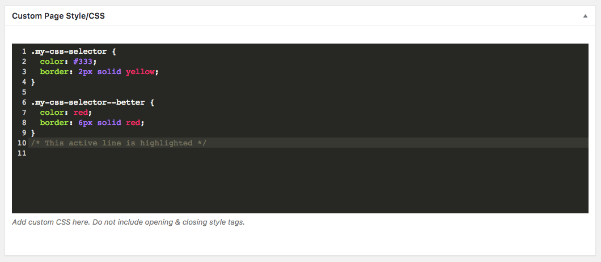

# CMB2 Syntax Highlighting
This plugin allows you to optionally add CSS or JavaScript syntax highlighting to `textarea_code` fields.



## Installation
Install like any other WordPress plugin.

## Usage
Add `'syntax_highlighting' => 'css'` or `'syntax_highlighting' => 'js'` when registering your CMB2 field:

```php
<?php

$cmb_demo->add_field( array(
		'name'                => esc_html__( 'Custom Page Style/CSS', 'text-domain' ),
		'desc'                => esc_html__( 'Add custom CSS here. Do not include opening & closing style tags.', 'text-domain' ),
		'id'                  => 'textarea_code_syntax_highlighting',
		'type'                => 'textarea_code',
		'syntax_highlighting' => 'css',
	) );
```

## Customization
Presently there are three filters — `'cmb2_syntax_highlighting_theme'`, `'cmb2_syntax_highlighting_dependencies'`, and `'cmb2_syntax_highlighting_codemirror_config'` — that allow you to customize the look and behavior CodeMirror.  To change the theme to `cobalt` you would add the following filter:

```php
<?php

add_filter( 'cmb2_syntax_highlighting_theme', function() {
	return 'cobalt';
} );
```

A list of available themes can be seen in the [CodeMirror demo](https://codemirror.net/demo/theme.html#monokai).
